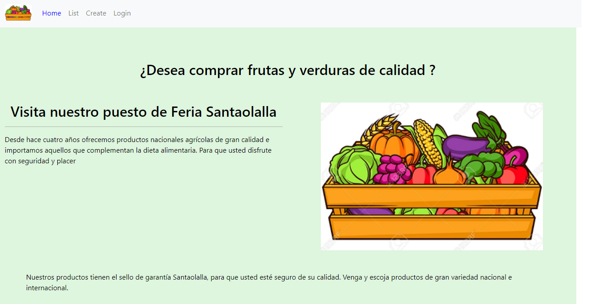

# Redux Simple  
Nuestro puesto de feria ya maneja usuarios con Redux, pero aún no el listado de los  
productos. Considerando lo anterior, es que nos piden que implementemos esta nueva  
funcionalidad en el proyecto. Esta funcionalidad se debe integrar al código ya existente en el  
Apoyo Desafío - Agregando un crud de productos, sin modificar el CRUD Usuarios.  

## preview  

]
